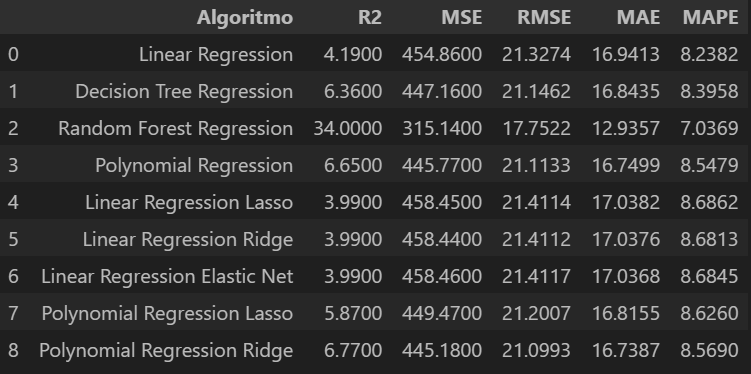

# Ensaio de Machine Learning

## Descrição
A empresa Data Money acredita que a expertise no treinamento e ajuste fino dos algoritmos, realizada pelos Cientistas de Dados, é o principal motivo dos ótimos resultados que suas consultorias vêm entregando aos clientes.

## Objetivo
O objetivo deste projeto é realizar ensaios com algoritmos de Classificação, Regressão e Clusterização para estudar a mudança no comportamento da performance à medida que os valores dos principais parâmetros de controle de overfitting e underfitting são alterados.

# Planejamento da Solução

## Produto Final
O produto final consistirá em sete tabelas apresentando a performance dos algoritmos, avaliados por meio de múltiplas métricas, para três conjuntos de dados distintos: treinamento, validação e teste.

## Algoritmos Avaliados

### Classificação:
- **Algoritmos:** KNN, Decision Tree, Random Forest e Logistic Regression
- **Métricas de Performance:** Accuracy, Precision, Recall e F1-Score

### Regressão:
- **Algoritmos:** Linear Regression, Decision Tree Regressor, Random Forest Regressor, Polynomial Regression, Linear Regression Lasso, Linear Regression Ridge, Linear Regression Elastic Net, Polynomial Regression Lasso, Polynomial Regression Ridge e Polynomial Regression Elastic Net
- **Métricas de Performance:** R², MSE, RMSE, MAE e MAPE

### Clusterização:
- **Algoritmos:** K-Means e Affinity Propagation
- **Métricas de Performance:** Silhouette Score

## Ferramentas Utilizadas
- Python 3.8
- Scikit-learn

# Desenvolvimento

## Estratégia da Solução
Para ensaiar os algoritmos de Machine Learning, serão implementados códigos em Python para treinar cada um dos modelos, variando seus principais parâmetros de ajuste de overfitting e analisando a performance final.

Os valores de parâmetros que proporcionarem a melhor performance serão selecionados para o treinamento final do algoritmo.

## Passo a Passo
1. Divisão dos dados em treino, teste e validação.
2. Treinamento dos algoritmos com os dados de treinamento, utilizando os parâmetros padrão (default).
3. Avaliação da performance dos algoritmos treinados com os parâmetros padrão no conjunto de treinamento.
4. Avaliação da performance dos algoritmos treinados com os parâmetros padrão no conjunto de validação.
5. Ajuste dos principais parâmetros de controle de overfitting até encontrar a melhor performance dos algoritmos.
6. Junção dos dados de treinamento e validação.
7. Retreinamento dos algoritmos com a junção dos dados de treinamento e validação, utilizando os melhores valores de parâmetros.
8. Avaliação da performance dos algoritmos treinados com os melhores parâmetros no conjunto de teste.
9. Análise dos ensaios e registro dos três principais insights obtidos.

# Principais Insights

### Insight 1
Os algoritmos baseados em árvores apresentaram melhor performance em todas as métricas nos dados de teste no ensaio de classificação.

### Insight 2
A performance dos algoritmos de classificação nos dados de validação foi semelhante à performance nos dados de teste.

### Insight 3
Os algoritmos de regressão não apresentaram boas métricas de performance, indicando a necessidade de uma melhor seleção de atributos e preparação das variáveis independentes do conjunto de dados.

# Resultados

## Ensaio de Classificação:
### Dados de Treinamento

### Dados de Validação

### Dados de Teste

## Ensaio de Regressão:
### Dados de Treinamento

### Dados de Validação

### Dados de Teste

## Ensaio de Clusterização:

# Conclusão
Este ensaio de Machine Learning proporcionou experiência na análise dos limites entre underfitting e overfitting nos algoritmos testados.

Os algoritmos baseados em árvores demonstraram sensibilidade à profundidade de crescimento e ao número de árvores na floresta, evidenciando a importância da escolha adequada desses parâmetros para evitar overfitting.

Os algoritmos de regressão, por outro lado, mostraram-se sensíveis ao grau do polinômio, sendo esse um fator crucial para balancear entre underfitting e overfitting.

Este ensaio foi fundamental para aprofundar o entendimento sobre o funcionamento de diversos algoritmos de classificação, regressão e clusterização, bem como sobre os principais parâmetros que controlam a transição entre os estados de underfitting e overfitting.

# Próximos Passos
Nos próximos passos, pretendo explorar novos algoritmos de Machine Learning e utilizar diferentes conjuntos de dados para ampliar o conhecimento sobre o comportamento dos modelos e identificar cenários que favoreçam um melhor desempenho.

